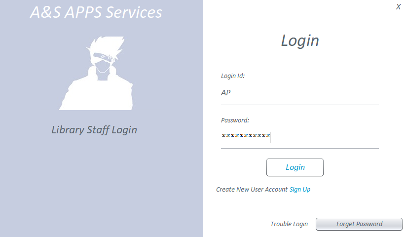
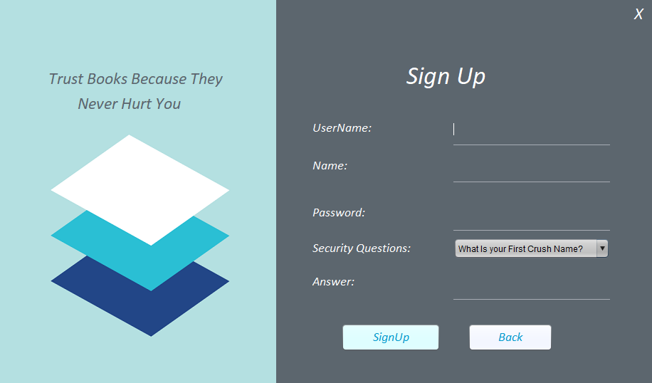
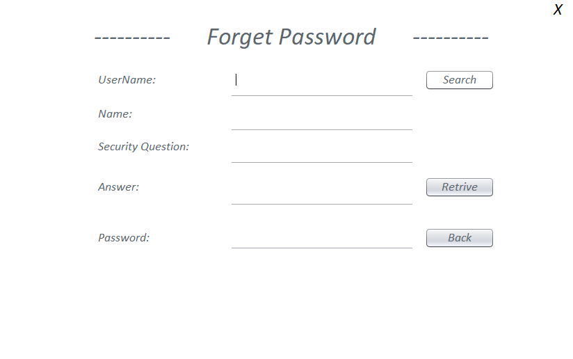
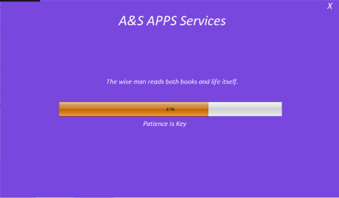
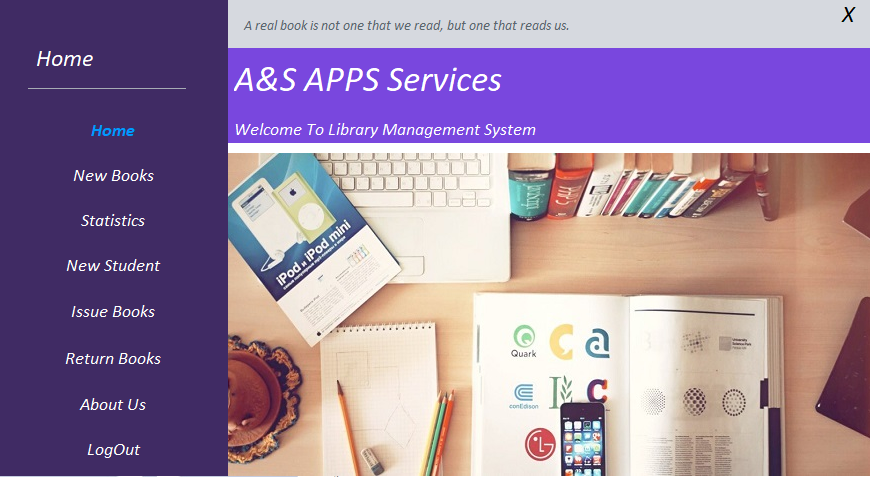
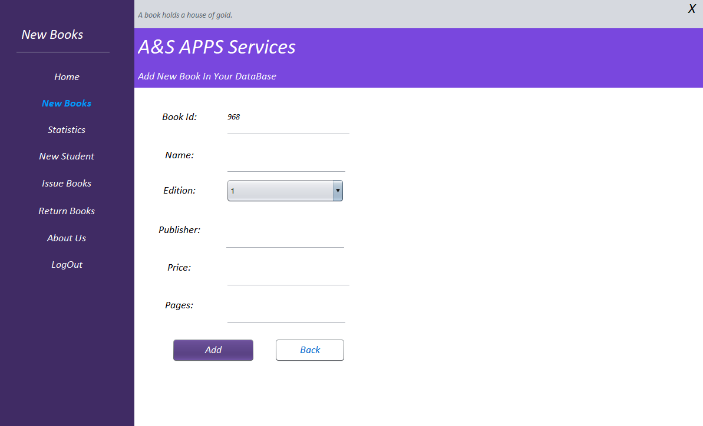
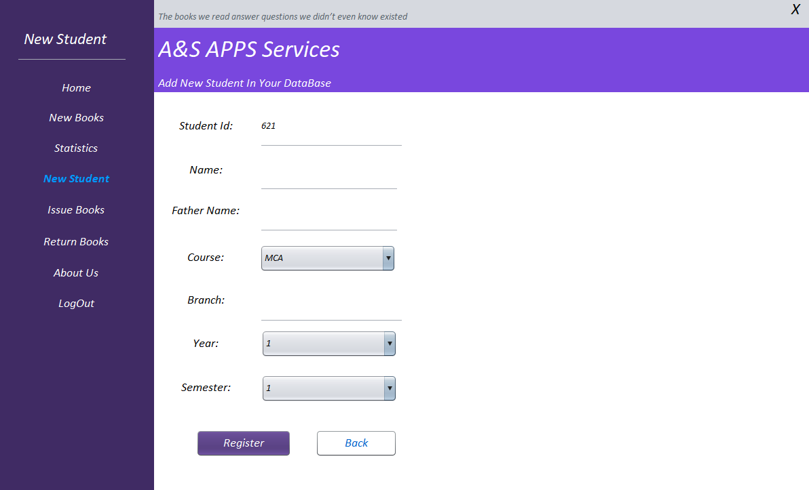
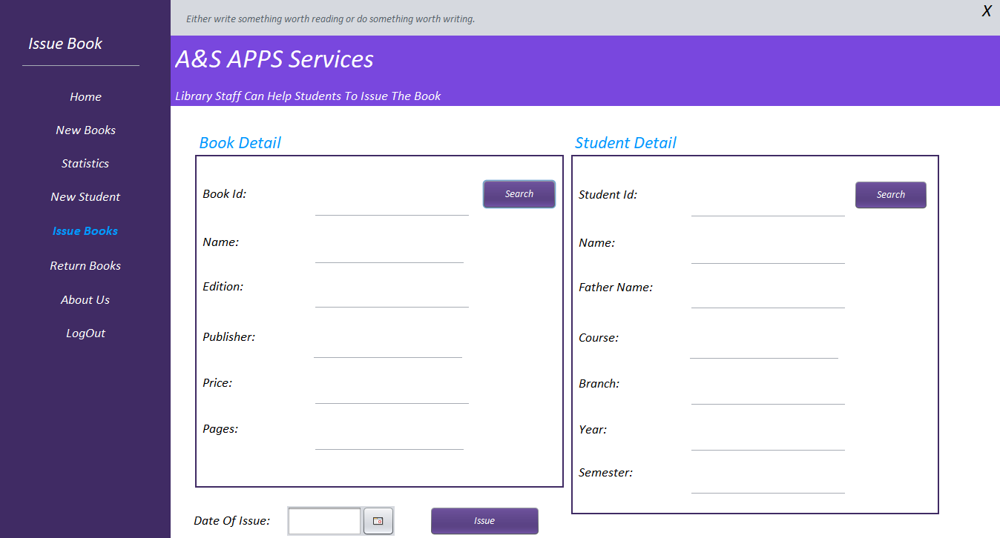
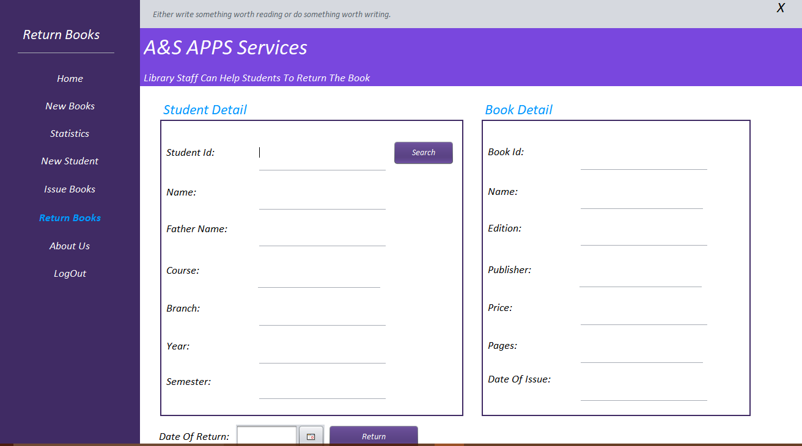
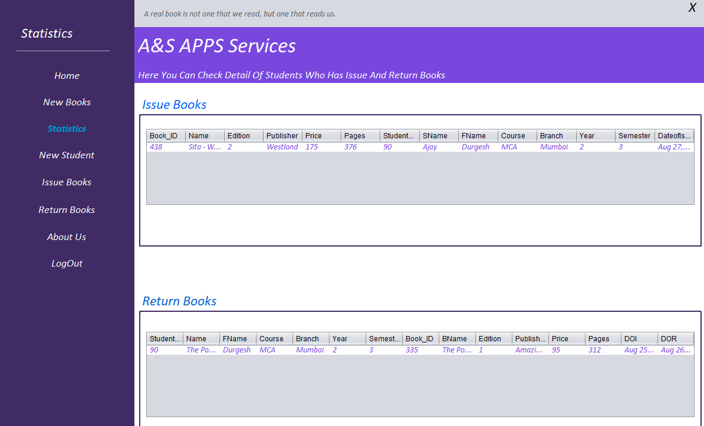

# Library-Management-System
**Topic :** Library Management System. **Database Used :** Sqlite. **Programming Language :** Java(Swing).

**Developer :** Akshay Patel.

**ScreenShot of Project**
```
#Login Page
```


```
#Sign Up Page
```


```
#Forget Password Page
```


```
#Loading Page
```


```
#Home Page
```


```
#Add New Books Page
```


```
#Add New Students Page
```


```
#Issue Book Page
```


```
#Return Book Page
```


```
#Statistics Page
```

